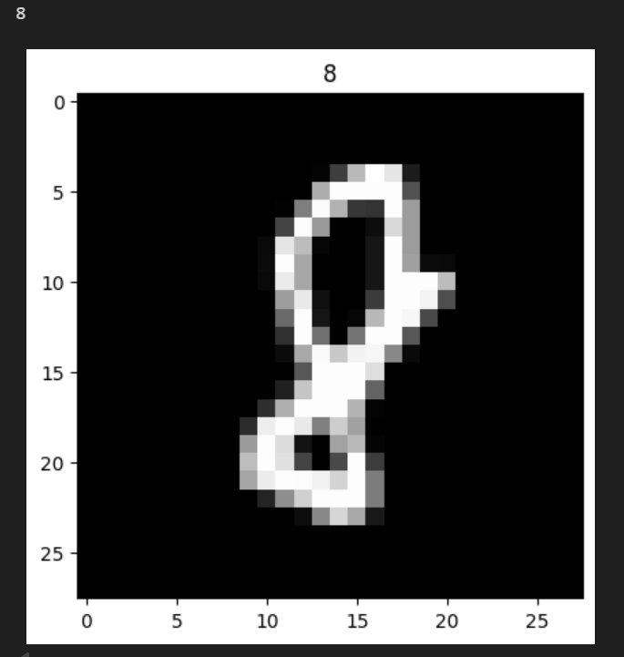

# CNN MNIST Digit Recognizer

This project implements a Convolutional Neural Network (CNN) using TensorFlow/Keras to classify handwritten digits from the MNIST dataset.

## Project Overview

The model is trained on the MNIST dataset from Kaggle and classifies digits from 0–9.

Architecture:

- Conv2D (32 filters)
- Batch Normalization
- ReLU Activation
- MaxPooling
- Conv2D (64 filters)
- MaxPooling
- Dense Layer (128)
- Output Layer (10 classes)

## Technologies Used

- Python
- TensorFlow / Keras
- NumPy
- Pandas
- Scikit-learn
- Matplotlib

## Dataset

Kaggle Digit Recognizer

https://www.kaggle.com/competitions/digit-recognizer
The dataset can be downloaded from this reporsitory also file name ['data.csv.zip']

## Results

Test accuracy achieved: **~98%**

Example prediction:

## How to Run

Install dependencies:
`pip install -r requirements.txt`

Run training:
python src/train.py

## Author

Hussein Ghandour
